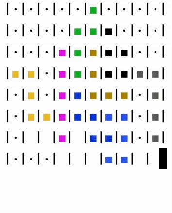

# Square puzzle solver

Many people like to solve puzzles. I like it too! And one day I decided to use a computer to solve puzzles. After that, the program was written.



# Installation
```bash
# poetry should be pre installed.
poetry install
```

# Usage

## Configuration
Before start the solver you should prepare configuration.

**Example:**
```json
{
 
  "puzzle": [
    [0,0,1,1],
    [1,0,0,0],
    [1,1,0,0],
    [1,1,1,0],
    [1,1,1,0]
  ],
  "figures": [
    [
      [1,1],
      [0,1]
    ],
    [
      [1,1]
    ],
    [
      [1,1,1,1]
    ]
  ]
}
```
**puzzle** - the puzzle to solve. 
- **0** - free places which should be filled
- **1** - filled in places

**figures** - contours of shapes involved in filling in
- **0** - free places
- **1** - filled in places

## Run 

```bash
python main.py -f examples/teapot.json
```
